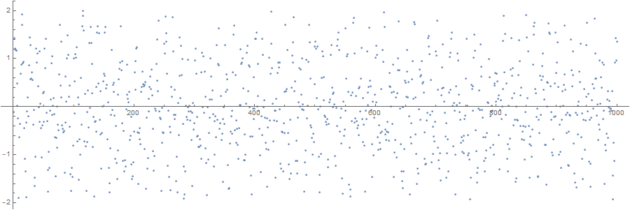
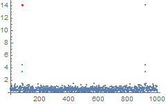
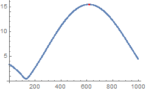

<!-- <script src="https://cdnjs.cloudflare.com/ajax/libs/highlight.js/9.15.8/languages/mathematica.min.js" ></script> -->


In Mathematica's [documentation devoted to `Fourier` command](https://reference.wolfram.com/language/ref/Fourier.html), I've stumbled upon an curious example of the frequency identification from  noisy data.
The most interesting part was that the frequency (or the period) was found with a high accuracy.
And this was done by only changing the parameters of `Fourier` command!

```mma
Fourier[data, Parameters -> {a,b}];
```

`Fourier[data]` calculates the Discrete Fourier Transform (DFT) of `data` and has two optional parameters `{a,b}`, which I always thought were used only to implement different definitions of DFT as used in mathematics or in signal processing, for instance.


The documentation page, however, gives a nice example of alternative use of the parameters. Below is a slightly modified version of the example.


## Code example

Here is some periodic data with period $T =12.46$ with some noise added, plotted for the discrete values of $x = 1,\ldots,100$:

```mma
n = 1000;
per = 12.46;
pdata = Table[Sin[2 \[Pi] x/per], {x, n}] + RandomReal[{-1, 1}, {n}];
ListPlot[pdata, AspectRatio -> 1/3, PlotStyle -> PointSize[.003], 
 ImageSize -> 900] 
```


Looks quite random for us humans, doesn't it? Let's inspect it with Mathematica.

Find the maximum mode in the spectrum:
```mma
f = Abs[Fourier[pdata]];
pos = Position[f, Max[f]][[1, 1]]

Show[ListPlot[f], Graphics[{Red, Point[{pos, f[[pos]]}]}], 
 PlotRange -> All]
```




```
rough = n/(pos - 1) // N
12.5
```

So roughly, the period is 12.5.

Find a high-resolution spectrum between modes where the maximum was found  by changing $b$ parameter to 1/500:

```
fr = Abs[Fourier[pdata Exp[2 Pi I (pos - 2) N[Range[0, n - 1]]/n], 
    FourierParameters -> {0, 2/n}]];
frpos = Position[fr, Max[fr]][[1, 1]]

617

Show[ListPlot[fr], Graphics[{Red, Point[{frpos, fr[[frpos]]}]}], 
 PlotRange -> All]
```



Now we can determine the period from the frequencies:
```
N[n/(pos - 2 + 2 (frpos - 1)/n)]

12.4639
```

## Explanations

What happens here is that we do interpolation of the  initial Fourier spectrum with sines by padding the original sequence with zeroes as if the total number or points is $n/b$. With $b= 2/n$, we've half a million points. 
_Mathematica_ does not calculate the whole DFT of the "virtually" padded sequence, however, but estimates only the first $n$ values.
That's why we need to shift ur spectrum there by multiplying the data with complex exponent sequence `Exp[2 Pi I (pos - 2) N[Range[0, n - 1]]/n]`.

I was not able to perform the same trick in Matalb, Python, or Julia. 
Please let me know if you know how to do it.

