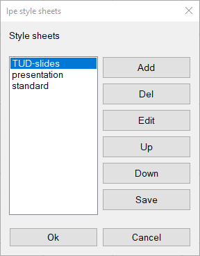
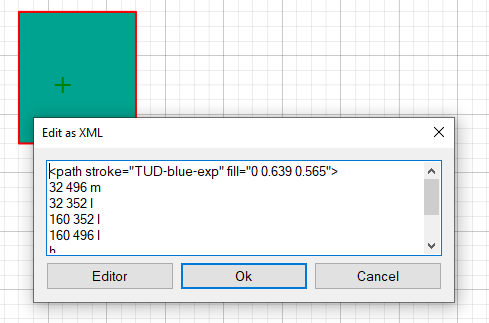
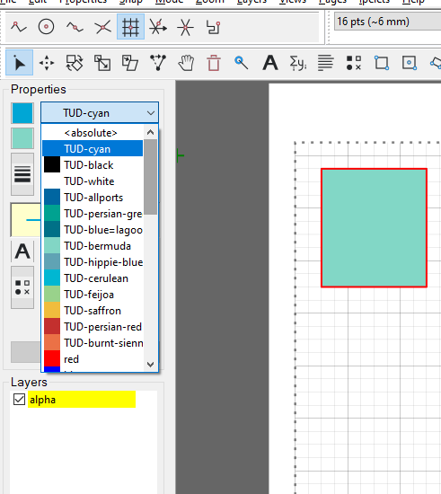
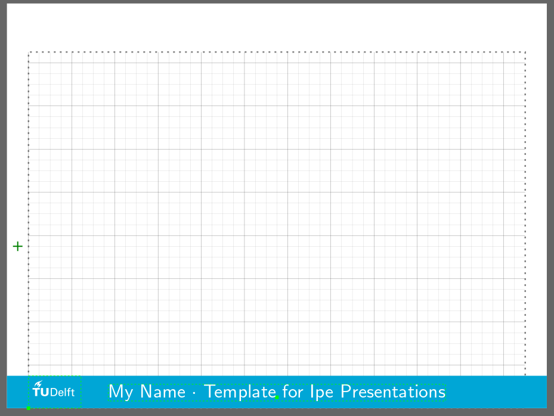
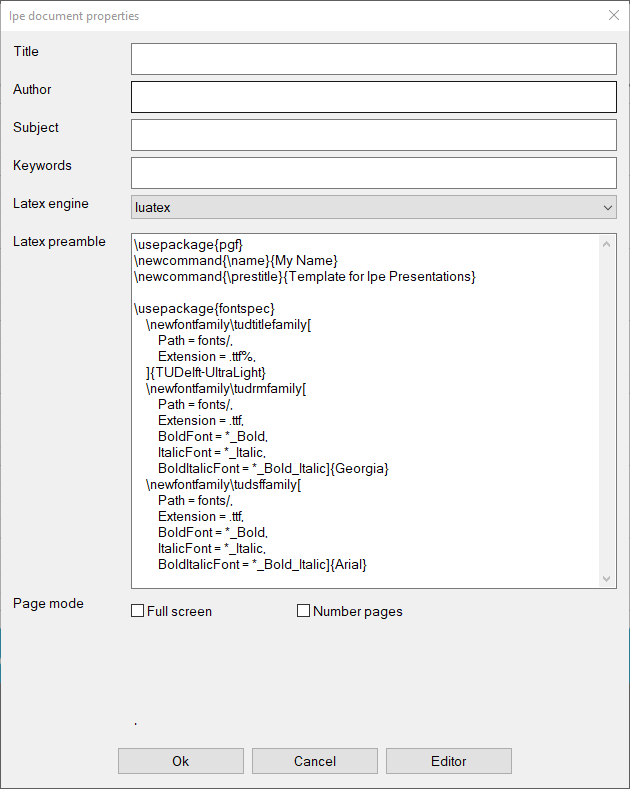
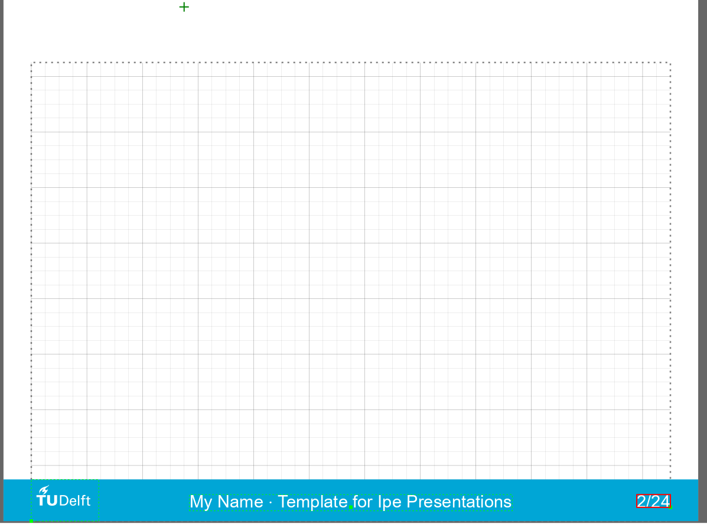
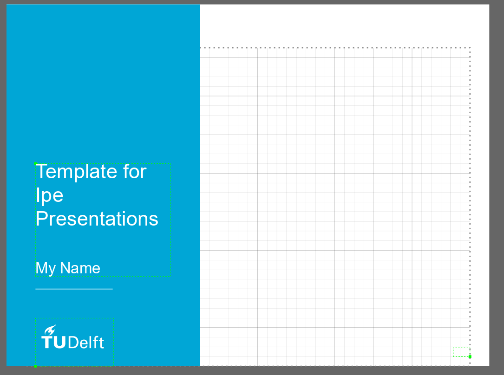

For approximately 50% or more, doing science is communicating your findings and results to the others.
Besides "summing it up" in a paper, we need from time to time to make presentations to be shown on screen for our team members, students, bosses, and our colleagues from other organisations.
Those of us who need to insert a lot of math in their presentations, eventually meet the dilemma of choosing between the convenience of visual arrangement
of things in MS PowerPoint and the easiness of typesetting beautiful math expressions provided by $\LaTeX$ (combined with  [Beamer](https://ctan.org/pkg/beamer), its excellent package for preparing presentations).

For my TU-related presentations, I've completely switched to Beamer approximately 7 years ago, and after some steep learning curve (_not of $\LaTeX$_, which I managed to master somewhere in 20th century, but of Beamer, which has 247 page-long [manual](https://mirror.koddos.net/CTAN/macros/latex/contrib/beamer/doc/beameruserguide.pdf)), I've got used to it, made some convenient keyboard shortcuts in [TeXstudio](https://www.texstudio.org/) and was quite satisfied with my tool.

Except for some minor but quite irritating and time demanding issues of alignment between different views of the same slide and difficulties of visually fine-tuning content of a slide (read: move a couple of pixel this to the left and rotate slightly clockwise that object and draw an arrow from this word to that part of the picture in another column and make it not jumping when a new portion of the figure is revealed in the following view).

Most of the pictures for my presentations and lectures I was drawing in my favourite graphics editor with ability to embed $\LaTeX$ labels named [Ipe](https://ipe.otfried.org/), which I was using since my PhD times. And maybe because I was using it for so long time, I was completely not aware that  besides preparing nice pictures for a presentation, I could do the whole presentation in it too! 

Last month, after recommending Ipe to one more colleague, I’ve looked again in its manual and I’ve discovered that it has this nice functionality. Of course, the very next presentation I’ve done for my TU Delft colleagues was made completely in Ipe.  And it was quite a relief, I should say! Everything was very easy to fine-tune visually, you can enjoy a lot of snapping modes, you can add new views and reveal parts of the drawing without fear that everything would jump suddenly, and of course you can type everything you need in $\LaTeX$!

The only thing I needed to learn is how to make a template for a presentation according to the recommended TU Delft house style. As I’ve spent quite a long time on this ([this resource](https://i11git.iti.kit.edu/anon-gitweb/?p=Misc/ipe.git;a=summary) of Karlsruhe Institute of Technology was extremely helpful), I thought it would be good to share it here with everyone interested in using Ipe for presentations and preparing their own templates. So I made this

## Mini-tutorial on making custom templates in Ipe

The instructions below are for TU Delft style, but of course, they can be easily adjusted to your needs.


1. Open IPE and save the empty file in a separate folder. I have folder `TUD-slides` and file name `TUD-slides-template.ipe`.	

2. As recommended in [Ipe manual on stylesheets](https://ipe.otfried.org/manual/onepage.html#sec:stylesheets), let’s create `TUD-slides.isy` file in the same folder: open a text editor with good XML support (notepad++ or VS code), type the following lines 
  ``` 
  <ipestyle name="TUD-slides">
  
  </ipestyle>
  ```

   and save it in the same folder as `TUD-slides.isy`

3. in Ipe, go to *Edit -> stylesheets*, delete `basic`, add `presentation` and our new `TUD-slides`:
   

2. Let’s start with adding styles and symbols to our style sheet to make a template according to [TU Delft house style](https://www.tudelft.nl/huisstijl).
   First, let’s define [the primary and secondary colours](https://www.tudelft.nl/huisstijl/bouwstenen/kleur). For this, we need to convert the given RGB values from the range  0..255 to the range 0..1. A simple way to do it is to create a filled rectangle in Ipe, set it absolute colour as RGB given by TUD style (e.g. `0,163,144`), then right-click it and show it as XML 
   From this you can copy-paste the values "0 0.639 0.565" to the style file, like 
   `<color name="TUD-green" value="0 0.639 0.565"/>`. You can select a fancier name using  [this site](https://chir.ag/projects/name-that-color/), for instance here it gives “persian-green”. 
   Now our style file looks like
   
   ```
   <ipestyle name="TUD-slides">
   	<color name="TUD-cyan" value="0 0.651 0.839"/>
   	<color name="TUD-black" value="0 0 0"/>
   	<color name="TUD-white" value="1 1 1"/>
   	<color name="TUD-allports" value="0 0.4 0.635"/>
   	<color name="TUD-persian-green" value="0 0.639 0.565"/>
   	<color name="TUD-blue-lagoon" value="0 0.443 0.533"/>
   	<color name="TUD-bermuda" value="0.51 0.843 0.776"/>
   	<color name="TUD-hippie-blue" value="0.38 0.643 0.706"/>
   	<color name="TUD-cerulean" value="0 0.718 0.827"/>
   	<color name="TUD-feijoa" value="0.6 0.824 0.549"/>
   	<color name="TUD-saffron" value="0.945 0.745 0.243"/>
   	<color name="TUD-persian-red" value="0.765 0.192 0.184"/>
   	<color name="TUD-burnt-sienna" value="0.922 0.447 0.275"/>
   </ipestyle>
   ```

   
   
   Save it and use *Edit -> Update style sheets*. Now all TUD colours should be available in Ipe:
   
   
3. Now let’s proceed with a slide layout according to [power-point examples]( https://www.tudelft.nl/en/tu-delft-corporate-design/presentations) or [latex-beamer examples](https://www.tudelft.nl/en/tu-delft-corporate-design/downloads). Although the beamer examples are a little bit outdated, they seem to me more suitable for presenting scientific information.
   Let’s make a horizontal colour band with white TUD logo on it. 

   1. Draw the band with TUD-cyan fill colour.
   2. For placing a logo, we can either place a png image (*File -> Insert image*)or use an ability of IPE of `\includegraphics` command from Latex package `pgf` or convert the eps file to IPE. I’ve used the second option. For this:
      1. Make `figs` subfolder and download there the logo in eps format.
      1. I’ve added `\usepackage{pgf}` to the preamble using Edit -> Document properties
      2.  I’ve converted the `.eps` logo to `.pdf` format using utility `ps2pdf` (you should have it installed if you have MikTeX):
         ` ps2pdf14 -dEPSCrop TU_P5_white.eps TU_P5_white.pdf`
         Then I created a text label and entered there `\includegraphics[height=48pt]{figs/TU_P5_white.pdf}`, where 48 pt was the height of my colour bar.
      3. To make the log exactly 48 pt height, enter any absolute value for the text label size. The reason is that it is stretched in the presentation stylesheet.
   
4.  Now let’s add useful information to this colour bar, like name of the presenter and the presentation short title (useful if someone joins your talk in its middle) and page numbers. Name and presentation title we might want to use in several places, so let’s code them in the preamble as Latex commands first: *Edit->Document properties* and add there 
```   
   \newcommand{\name}{My Name}
   \newcommand{\prestitle}{Template for Ipe Presentations}
```

Now you can create a text label with something like 
    `\name{} $\cdot$ \prestitle` inside. Make it centre-aligned and of white colour.
    Your canvas should look like this now:
    
    

7. The font used does not correspond to the house style of TU Delft. It should use Arial for body text and Georgia for quotes. This can be done if we will use $Lua\LaTeX$ or $Xe\LaTeX$ as compiler and use package `fontspec`. Provided you have installed the fonts in your system, add to the Latex preamble the following:

   ```\usepackage{fontspec}
   \usepackage{fontspec}
       \newfontfamily\tudtitlefamily[
           Extension = .ttf%,
       ]{TUDelft-UltraLight}
       \newfontfamily\tudrmfamily[
           Extension = .ttf,
           BoldFont = *_Bold,
           ItalicFont = *_Italic,
           BoldItalicFont = *_Bold_Italic]{Georgia}
       \newfontfamily\tudsffamily[
           Extension = .ttf,
           BoldFont = *_Bold,
           ItalicFont = *_Italic,
           BoldItalicFont = *_Bold_Italic]{Arial}
   ```
   
   and change the Latex engine to lualatex:
   

(I’ve changed it, please see later).
Set the absolute value for the line to 20 pt.

Finally, add a text label with dummy page numbering. Now you should have something like that:



9. Now let’s make a symbol from the colour bar, logo, and status line. Select them (without the page number) and group together (*Ctrl+G*). Make a symbol from this group: *Ipelets->symbol>create symbol (in top stylesheet)* with the name `Background` (note the capital “B”).
   Check that the symbol works by creating a new page. It should have this colour bar.

10. Save the changes in the style file: *Edit ->  Style sheets*, select TUD-slides and press save. Overwrite your old file. Notepad++ should show your the updated version

11. Now you can delete this group but still see the same symbol.

12. Let’s style the page number. Switch on the page numbering in *Document properties*. You will see black number in the lower left corner. We are going to change it to our style. First, update the stylesheet. Now, according to https://ipe.otfried.org/manual/onepage.html#sec:presentations add 

    ```
    <pagenumberstyle pos="20 820" size="Huge" color="0.5 0 0" 
      valign="top">\arabic{ipePage}/\arabic{ipePages}</pagenumberstyle>
    ```

to the stylesheet. Right-click your dummy page number, select *Edit as Xml* and copy the parameters to the `pagenumberstyle`

```
<pagenumberstyle pos="736 16" color="TUD-white" type="label" width="38.78" 
   height="14.509" depth="0.24" halign="right" valign="baseline"
   size="20">\arabic{ipePage}/\arabic{ipePages}</pagenumberstyle>
```

Now you can update the style sheet and delete your dummy page numbering and check how the page numbers are inserted automatically.

Before we proceed, let’s also move the Latex styling that user should not change to the style file. Make a new section in the style file 

```
<preamble>
    
</preamble> 
```

and move there font settings and packages.

On the first page, create a new layer called `BACKGROUND` (note all capitals). Draw there the desired layout (you can use the defined commands like `\prestitle` and `\name`)




Congratulations, the template is ready! To make a new presentation, just make a copy of the `TUD-slides` folder (including `figs`) subfolder, and edit `TUD-slides-template.ipe` file. 


### Possible improvements

You can convert the logo from PDF to Ipe format (using `pdftoipe` script supplied with Ipe) and make a symbol of it, which you can save in a the stylesheet and make it self-contained and independent from a logo saved in external folder. You can then move the file to Ipe style folder (use *Help -> Show configuration* to find out where it is located) and create new presentations in TU Delft style just by activating this stylesheet. 

You can find the results of such modification [here](https://github.com/olejorik/TU-Delft-slides-Ipe).