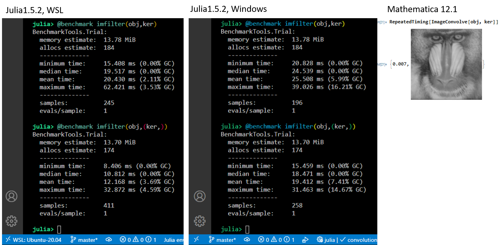
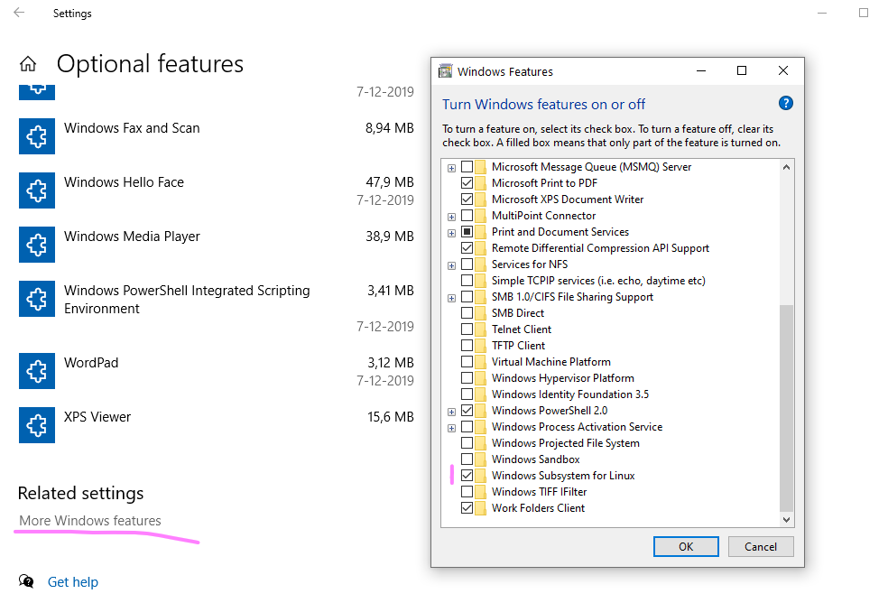
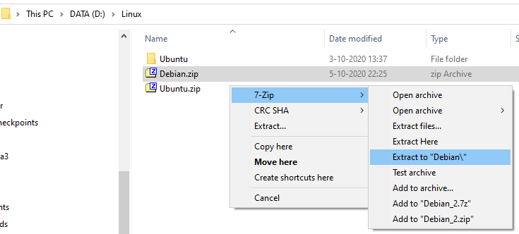
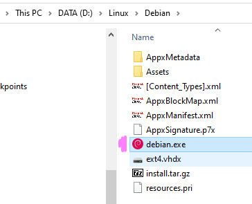
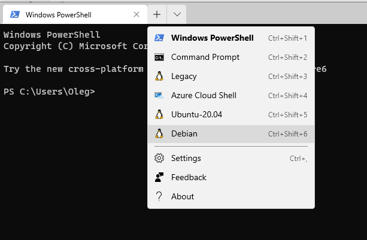

From its first days, Windows 10 provided a full-featured Linux (sub)system, called WSL. To get access to it and use it, one needed just to activate the developer mode and voilà --- you typed `bash` and got Ubuntu 2016 (in terminal only). I tried it, installed python via conda, watched how the free space on my fast but small system drive (SSD) quickly disappeared and forgot it. 

Recently, I've seen on Internet some news about WSL2, the second version of this Linux subsystem. Publications praised the diversity of the distributives (you are not limited to Ubuntu anymore), a closer integration with Windows (you can call Windows programs from Linux, and the filesystems of Windows and Linux can be accessed bidirectionally), and I also saw some manuals how to install WSL on another drive. Finally I've got some time to try it, and it worked even better than I expected! Namely, the benefit I've got is a faster version of Julia on my computer (not to mention enjoying 24K colours in REPL and normal work of all commands in the shell mode 😉).

Here are the results from a simple benchmarking of convolving a 512 x 512 image with a 48 x 48 blur kernel. (In our [MADEin4](/project/madein4) project, we need to simulate a position-dependent blur, so the convolution speed is a very important parameter for us).

The screenshots below show (left to right) the speed of this convolution (two different algorithms) calculated by Julia running in WSL and Julia running in Windows, both versions 1.5.2 (and the same convolution made in *Mathematica 12.1* for comparison purposes). You can see that the faster version of the algorithm (the second benchmark test) in WSL is almost twice faster as in its Windows version and is approximately as fast as *Mathematica* implementation.

<!--  -->



## How to install WSL2 where you want it
Here are the successive steps that I did, following the nice instructions of [this](https://damsteen.nl/blog/2018/08/29/installing-wsl-manually-on-non-system-drive) tutorial. Everything can be done directly in PowerShell, or, if you are not familiar with it, in a more Windows manner using your mouse.

1. Press Windows key and type "Optional Features", press enter to open the following settings page and select there "More Windows features":

or just open PowerShell and enable the WSL2 by executing:
```powershell
Enable-WindowsOptionalFeature -Online -FeatureName Microsoft-Windows-Subsystem-Linux
```

I needed to do it despite that I had already  the WSL enabled (WSL1, the "Legacy version"), and I needed to reboot after this command.

2. If you have not yet created a directory where you want to have your Linux, create it. You can use the following PowerShell command or a less exotic way like right-click in the explorer window and so on:
```powershell
New-Item D:\Linux -ItemType Directory
```

3. `cd` there. Again, you can use the special PS command (it also can change the drive):
```powershell
Set-Location D:\Linux
```
4. Now you need to download the desired Linux distro and place it in this directory. Go to [this](https://docs.microsoft.com/en-us/windows/wsl/install-manual#downloading-distros) page, choose what you want, right-click and save it or again you can use the PowerShell: copy the link address and substitute it in the command below.

```powershell
Invoke-WebRequest -Uri https://aka.ms/wslubuntu2004 -OutFile Ubuntu.appx -UseBasicParsing
```

5. Rename the downloaded ".appx" file in ".zip" file and extract it (here shown on example of Debian distro)


or 
```powershell
Rename-Item .\Ubuntu.appx Ubuntu.zip
Expand-Archive .\Ubuntu.zip -Verbose
```

6. Congratulations! You've almost done. Now you can change to the extracted directory and double click the "*linux_distro*.exe" file 


or execute in the PowerShell

```powershell
.\Ubuntu\ubuntu2004.exe
```
Input you username and password (remember them well or save them immediately in your password manager, like KeePass), and after some time the installation will be finished. 

You can use your WSL2 now!

7.(OPTIONAL) Because I had still traces of the old WSL system (although I have uninstalled it), I needed to issue the following command to make my new WSL2 act as default Linux subsystem (*e.g.* I can invoke it by typing `bash` in terminal):

```powershell
wsl --set-default-version 2
wslconfig /s Ubuntu-20.04
```
{}
You can also launch it by executing `wsl` or `ubuntu` commands
{}

Also I recommend to instal the new [Windows Terminal](https://aka.ms/terminal), where you will have immediately easy access to all you Linuxes :-)



## How to install "official" release of Julia in your WSL
To install Julia in your WSL, you can use the packages provided by the distro, but chances are high you've got some old version. Instead, install the latest stable release from jullialang.org.

Basically, you need to follow the [instructions from their webpage](https://julialang.org/downloads/platform/#linux_and_freebsd).

For more detailed instruction, [follow this tutorial.](https://ferrolho.github.io/blog/2019-01-26/how-to-install-julia-on-ubuntu)

To summarize, it's as easy as downloading, unpacking, copying to `/opt` directory, and making a link:
```bash
$ wget https://julialang-s3.julialang.org/bin/linux/x64/1.5/julia-1.5.2-linux-x86_64.tar.gz

$ tar -xvzf julia-1.5.2-linux-x86_64.tar.gz

$ sudo cp -r julia-1.5.2 /opt/

$ sudo ln -s /opt/julia-1.5.2/bin/julia /usr/local/bin/julia
```

Now you can try to type `julia` and see it working!

{}
**Note:** in Debian installation, I was not able to use `wget` command shown above; the system complained about not valid security certificates of julialang.org. The problem was solved by installing CA-certificates:
```bash
$ sudo apt-get install ca-certificates
```
{}

{}
My Ubuntu 20.04 installation appeared to be extremely slow in installing julia packages ("updating registry"); julia itself was running fast.
Debian installation does not have such problem and is now my default WSL.
{}

## How to use your installation in VS code or Jupyter lab

## VS Code
To connect VS Code to WSL, I followed its [manual page](https://code.visualstudio.com/docs/remote/wsl).
As I've had VS Code already installed, I needed to add `%USERPROFILE%\AppData\Local\Programs\Microsoft VS Code\bin` to my path manually. 

Then I navigated to my Windows folder with Julia projects (thus _not in WSL filesystem_) and opened it from bash by executing `code .`.

In addition, I installed in this version of VS Code the julia extension (see [here](https://techytok.com/julia-vscode/) for more detailed instructions).

### Jupyter lab
You can install in your distro conda, Python and Jupyter as usual, and set julia to use them, but in this case, I decided to keep everything within the julia installation.

First as usual, `] add IJulia` and launch Jupyter lab from within julia:
```julia
julia> using IJulia

julia> IJulia.jupyterlab()
install Jupyter via Conda, y/n? [y]: y
```

Give julia some time to install everything necessary and wait until  the activity in the terminal ends with a message beginning like
```bash
[ Info: running setenv(`/home/oleg/.julia/conda/3/bin/jupyter lab`,["PATH=/home/oleg/.julia/conda/3/bin: 
```
Actually, now the jupyter server is installed and running, but if you don't have a browser installed in WSL, you cannot go further. Press Ctrl+C here. Now we are going  to create and edit jupyter config file so any existing Windows browser could be used.

To create the config file, execute in bash
```bash
$ ~/.julia/conda/3/bin/jupyter notebook --generate-config
```
The system will display something like
```bash
Writing default config to: /home/oleg/.jupyter/jupyter_notebook_config.py
```

Now open this file in VS Code
```bash
$ code ~/.jupyter/jupyter_notebook_config.py
``` 
and find and edit there the default browser setting (line beginning with `c.NotebookApp.browser `). I set it to MS Edge, which I don't use usually, so my Jupyter lab activities are kept separately from my usual web browsing:
```python
c.NotebookApp.browser = u'/mnt/c/Program\ Files\ \(x86\)/Microsoft/Edge/Application/msedge.exe %s'
```

In addition, disable the redirect file behaviour by changing the line starting with `c.NotebookApp.use_redirect_file` to
```python
c.NotebookApp.use_redirect_file = False
```

Now yuo should be able to launch Jupyter lab either from julia
```julia
julia> using IJulia
julia> IJulia.jupyerlab()
```
or from bash
```bash
$ ~/.julia/conda/3/bin/jupyter lab
```