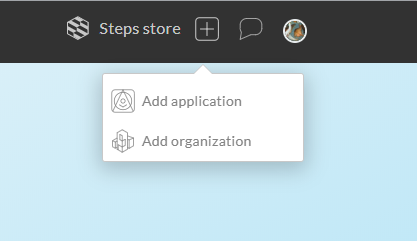
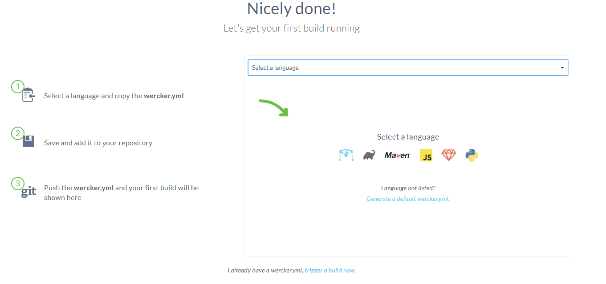
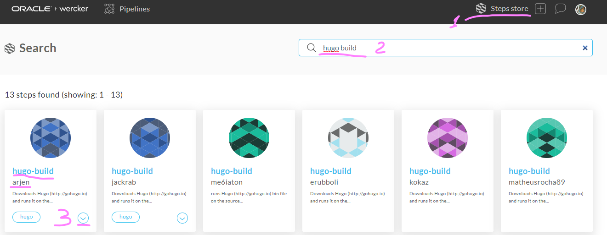
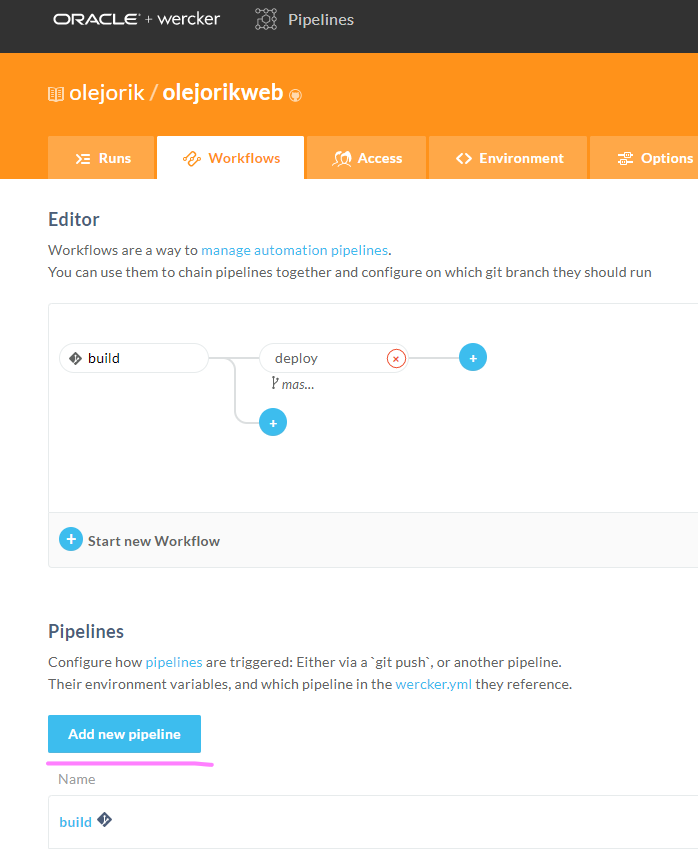
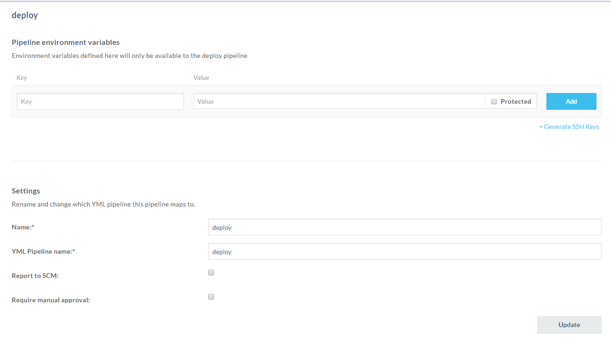
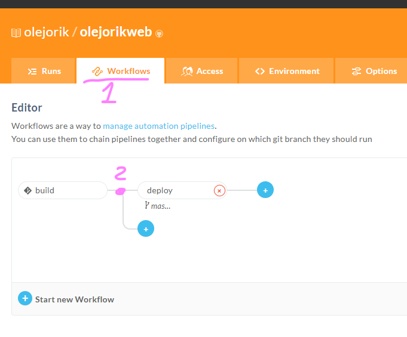

When maintaining a static website with Hugo, the workflow is to create a source of a post in Markdown, run Hugo to generate the html pages, and upload the resulted html to the web. The repeating last two steps can be automated in a script or a batch file that can be run on a local computer, so every time the content is updated, its rendered version is uploaded to the web. If however, the content is edited with some online services, like Forestry, how can you update the rendered html pages?

This can be done with automated deployment workflows. For this, you need to have an account on one of the multiple services that provide you (often free of charge for a small or a personal project) a virtual machine, where the source of your site can be downloaded, Hugo installed and run on the source, and in case of success, the rendered html pages uploaded to the destination. Sounds really high tech and fantastic, but it seems to be quite a common practice amongst the professional developers, called Continuous Integration/Continuous Deployment (CI/CD). The links to instructions for several services are collected on [a Forestry doc page](https://forestry.io/docs/hosting/) and [on Hugo doc pages](https://gohugo.io/hosting-and-deployment/) as well.

For an occasional user of this method, however, it is easy to make a mistake in setting it up and running. Moreover, different services have different requirements and limitations. GitLab, for instance, provides built-in CI/CD, but publishes the results on their webpages which have way too long url, in my opinion. Here I describe the steps which finally lead me to a successful implementation.

I have followed the steps for [automatic deployment with Wercker](https://gohugo.io/hosting-and-deployment/deployment-with-wercker/), with some changes. My site source repo was already set up on GitHub, and I was hosting the rendered version on GitHub pages, so I proceeded directly to the step of [Wercker setup](https://gohugo.io/hosting-and-deployment/deployment-with-wercker/#set-up-wercker). Wercker is a service that can monitor the status of my site source repo, and after I push some content to it, it performs the automated deployment steps. It seems that Wercker's interface has been updated since the time the manual was written, and some steps that require changes are indicated below.

I have logged in with my GitHub account, so the link between Wercker and GitHub was automatically created. Then I proceeded till [Add your project](https://gohugo.io/hosting-and-deployment/deployment-with-wercker/#add-your-project) step, which now should be changed to _Add application_.
Use the boxed plus button in the top right corner:

The application is created in 4 steps, where I have pointed to the repo with my website source and accepted all default options. Now I was at ["App successfully created](https://gohugo.io/hosting-and-deployment/deployment-with-wercker/#app-successfully-created) step and there were some small differences. The screen I saw was like that:  

I saw there Hugo icon, clicked it, obtained some config file,and ... And actually I didn't need it.

Instead, I needed to go to the "Steps store" (again top right corner), to find there "hugo build" steps script, and to read its documentation to understand how to use it. 

Finally, I understood that all I needed to do is simply to create  a file named `wercker.yml` in the root of my source repo with the following content:

    box: debian
    build:
      steps:
          - arjen/hugo-build:
            version: "0.68.3"
            theme: academic

and push it to the GitHub repo.

 Wercker has started its job and... failed.

 After some investigation, I realized that the reason was that the "academic" theme which I use was installed as a submodule (so it is not a part of my repo), and thus it was not downloaded from git. To fix that, I added steps to the `wercker.yml` which installed git and downloaded the submodule. Now the file looked as shown below, and Wercker has completed the build successfully!

    box: debian
    build:
      steps:
        - script: 
            name: install git
            code: |
                apt-get update
                apt-get install git -y
        - script:
            name: initialize git submodules
            code: |
                git submodule update --init --recursive
    
        - arjen/hugo-build:
            version: "0.68.3"
            theme: academic

Then I proceeded with the manual up to the step [Set the App’s Deploy Target](https://gohugo.io/hosting-and-deployment/deployment-with-wercker/#set-the-apps-deploy-target), where I was stuck again, because there were no button "Deploy target" in the Wercker interface. Instead, I needed to create a new pipeine and to call it `deploy`, and to add it to the workflow after the `build` pipeline:   

Then I added the corresponding instructions to the Wercker config file as shown below, pushed it to GitHub and everything worked!

    box: debian
    build:
      steps:
        - script: 
            name: install git
            code: |
                apt-get update
                apt-get install git -y
        - script:
            name: initialize git submodules
            code: |
                git submodule update --init --recursive
    
        - arjen/hugo-build:
            version: "0.68.3"
            theme: academic
    deploy:
      steps:
        - install-packages:
            packages: git ssh-client
        - lukevivier/gh-pages@0.2.1:
            token: $GIT_TOKEN
            basedir: public
            repo: olejorik/olejorik.github.io

Actually, it was a trial-and-error process (as can be seen in the commit history of the site), but I omit all these details :wink:.

### Summary

To make your rendered version of a Hugo website automatically updated after every change you push the source repo, log in to Wercker with your GitHub account, add an application with two pipelines in a workflow, named `build` and `deploy` and add a corresponding `wercker.yml` file to the root of your source repo.

After everything works as expected, you might want to delete the submodule `public` from the source repo.